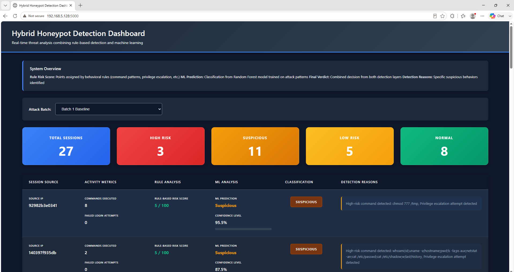
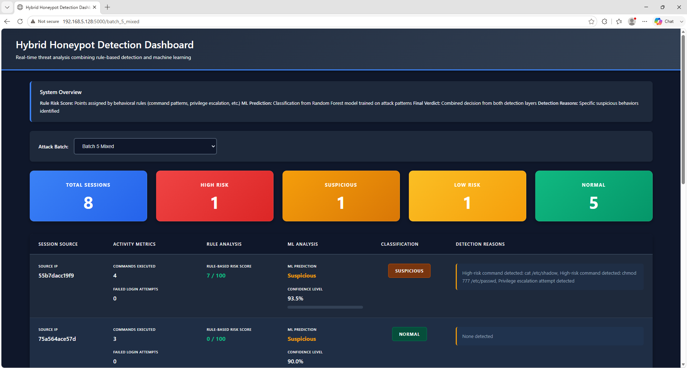

# Hybrid Behaviour Detection for Medium-Interaction Honeypots

> Turning passive SSH honeypot logs into real-time threat intelligence using a four-stage hybrid detection pipeline.

A hybrid intrusion detection system that transforms raw Cowrie SSH honeypot logs into actionable, explainable threat classifications — combining deterministic rule-based scoring with a Random Forest machine-learning model, surfaced through a Flask SOC dashboard.

**BSc (Hons) Cyber Security honours project (CO3008) · University of Central Lancashire · 2025/26**
Author: Mohammed Jangeer · Supervisor: Maaz Rehan · **Graded Exceptional First Class**

---

## The problem

Cowrie SSH honeypots capture rich attacker session data but only produce passive JSON log files. Security teams have no automatic way to separate genuine threats from benign reconnaissance noise — every session has to be reviewed by hand. Existing IDS tools such as Snort and Suricata rely on live traffic interception and can't operate on already-captured honeypot logs, leaving a clear detection gap.

This project closes that gap with a lightweight behavioural detection layer that adds automated classification and alerting on top of a medium-interaction honeypot — no expensive hardware, no high-interaction complexity.

---

## The four-stage hybrid pipeline

Each stage is a separate script with its own JSON output, so every stage can be verified independently — a deliberate design choice for explainability in a SOC context.

| Stage | Script | What it does | Output |
|-------|--------|--------------|--------|
| **1 — Feature extraction** | `extract_features.py` | Reads raw `cowrie.json` line by line, groups events by **session ID**, counts failed logins and records commands per session | `session_features.json` |
| **2 — Rule-based detection** | `rule_engine.py` | Applies 6 deterministic behavioural rules, accumulates a risk score per session, and records the exact reason for every flag | `stage2_alerts.json` |
| **3 — ML classification** | `ml_predict.py` | Loads a Random Forest model (trained in Google Colab), combines 13 engineered features with TF-IDF command vectors, outputs Suspicious/Normal + confidence | `ml_predictions.json` |
| **4 — Flask dashboard** | `dashboard.py` | Joins all three outputs by session ID, applies the hybrid verdict, and presents results in a web SOC dashboard with a batch selector for forensic comparison | Web dashboard |

### Hybrid verdict logic
Both detection methods must agree before a session is escalated — neither rules nor ML can raise a High Risk verdict alone, which prevents single-method false positives.

| Rule score | ML prediction | Final verdict |
|-----------|---------------|---------------|
| 3 or above | Suspicious | **High Risk** |
| 5 or above | Suspicious | Suspicious |
| 1 or above | Any | Low |
| 0 | Any | Normal |

---

## Detection detail

**Rule engine — 6 behavioural rules:** failed logins (+1), high command volume (+1), high-risk commands such as `wget`/`curl`/`chmod`/`bash` (+2), automation flag (+2), reconnaissance pattern (+1), and privilege escalation via `sudo`/`su`/`/etc/shadow` access (+2).

**Machine learning — Random Forest on 13 engineered features:** failed logins, command count, diversity score, burst score, recon count, privilege-escalation attempts, sudo flag, download flag, sensitive access, recon flag, persistence flag, commands-per-login, and sensitive count — combined with a TF-IDF vectorisation of the raw commands. Trained in Google Colab and deployed to an Ubuntu VM via joblib.

---

## Key engineering highlight — the IP-collapse fix

The original design grouped sessions by source IP address. Under concurrent attacks, multiple connections from the same source merged into one session, destroying individual attacker data. This was fixed by refactoring the pipeline to use **Cowrie's unique session ID (UUID)** instead — so every connection keeps its own identity regardless of source IP. After the refactor, the pipeline correctly processed 27 concurrent sessions with no identity corruption.

This was one of **ten engineering failures documented and resolved** during development — each treated as a technical insight that shaped the final architecture, not just a bug.

---

## Tech stack

- **Cowrie** — SSH medium-interaction honeypot (data source)
- **Python 3** — all pipeline scripts
- **scikit-learn** — Random Forest classifier + TF-IDF vectorisation
- **Flask** — web dashboard
- **Google Colab** — ML model training environment
- **joblib / pickle** — model serialisation and deployment
- **Ubuntu VM / VMware** — deployment environment
- **sshpass / Kali Linux** — automated attack simulation

---

## Results

Evaluated across **73 synthetic attack sessions** generated from **10 distinct attack profiles** (reconnaissance, privilege escalation, persistence, credential harvesting, automated command bursts) tested across **6 batch scenarios**:

- All **four risk tiers** (Normal, Low, Suspicious, High Risk) correctly assigned across every batch scenario
- High Risk profiles consistently triggered both a Stage 2 alert and a Suspicious ML classification at **85–95% confidence**; Normal scans correctly scored 0 and returned Normal predictions (false-positive suppression)
- **27 concurrent sessions** processed with no identity corruption after the UUID refactor
- Sub-second dashboard responsiveness for batch selection and reprocessing
- Batch reprocessing (`reprocess_batches.sh`) enables regression testing across scenarios

> **Honest note on metrics:** formal precision, recall and F1 were not calculated, because the dataset was synthetic. The system was validated through controlled attack scenarios demonstrating correct tiering and false-positive suppression. Statistical benchmarking on real honeypot traffic is identified as future work.

---

## Running it

The dashboard is the main entry point once the pipeline outputs exist:

```bash
python3 dashboard.py
```

Then open the local address Flask prints (typically `http://127.0.0.1:5000`) in a browser.

To run the full pipeline from raw logs, execute the stages in order first:

```bash
python3 extract_features.py   # Stage 1 → session_features.json
python3 rule_engine.py        # Stage 2 → stage2_alerts.json
python3 ml_predict.py         # Stage 3 → ml_predictions.json
python3 dashboard.py          # Stage 4 → launches the dashboard
```

To reprocess archived attack batches for regression testing:

```bash
./reprocess_batches.sh
```

---

## Project structure

```
├── extract_features.py       # Stage 1 – feature extraction
├── rule_engine.py            # Stage 2 – rule-based detection
├── ml_predict.py             # Stage 3 – ML classification
├── dashboard.py              # Stage 4 – Flask SOC dashboard
├── dashboard.html            # dashboard template
├── reprocess_batches.sh      # batch reprocessing / regression testing
├── honeypot_ml_model.pkl     # trained Random Forest model
└── honeypot_tfidf.pkl        # TF-IDF vectorizer
```

---

## Screenshots

**Live dashboard — Batch 1 baseline (27 sessions across all four risk tiers):**



**Batch selector — switching to Batch 5 Mixed for forensic comparison:**



---

## Future work

- Replace batch processing with Kafka streaming for real-time detection
- Train the ML model on real honeypot data rather than synthetic sessions
- WCAG 2.1 compliant dashboard for accessibility
- Production SOC deployment and longitudinal evaluation
- Extend to additional honeypot interaction levels

---

## About

Developed as my BSc (Hons) Cyber Security honours project. It's shared to demonstrate my approach to detection engineering, applied machine learning in security, and building analyst-facing tooling — not just a model, but something a SOC analyst could actually use.
